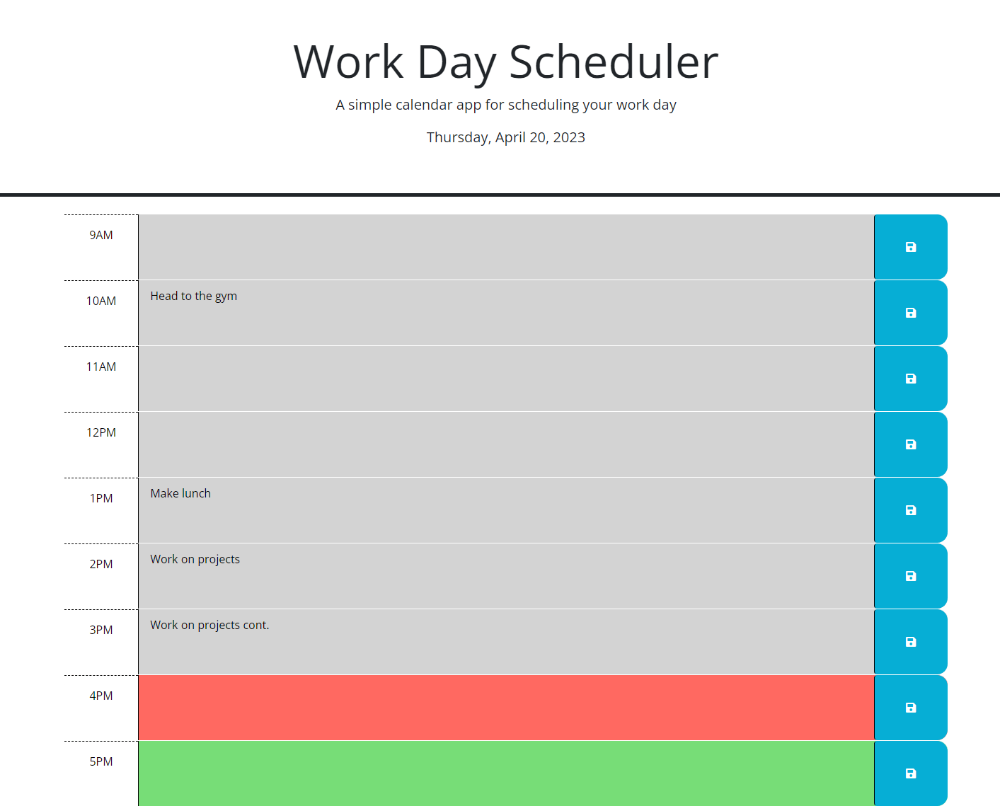

# Work-Day_Scheduler

## Description

The purpose of this project was to create a time reponsive schedule calender using jQuery and Day.js. We needed to utilize local storage in order to be able to view previously entered data. Using Day.js, I was able to actively able to recieve the exact date and time of day and have my webpage respond accordingly.

This project has helped me have a better understanding of the usage of jQuery and Day.js.

## Usage

<ul>
    <li>
        <a href="https://github.com/Soleiles/Work-Day_Scheduler">Repository</a>
    </li>
    <li>
        <a href="https://soleiles.github.io/Work-Day_Scheduler/">Live Site</a>
    </li>
</ul>

## License

Refer to license in the repository.